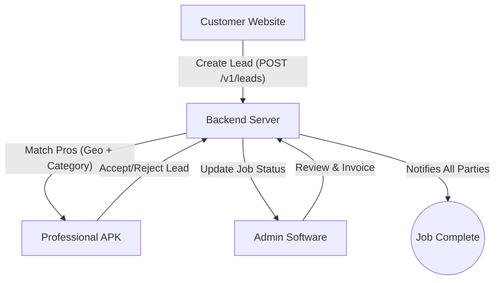

# 🌐 Sales Software Ecosystem: Data Flow Documentation

This document outlines the standard data architecture and flow between the **Customer Website**, **Mobile APK**, and **Admin Management Software**.

---

## 1. The Ecosystem Overview

| Platform | Primary Actor | Role | Base Connection |
| :--- | :--- | :--- | :--- |
| **Sales Website** | Customer | Creates Leads / Requests Service | `api.hinesq.com/v1/leads` |
| **Sales APK** | Professional | Accepts Leads / Manages Jobs | `api.hinesq.com/v1/assignments` |
| **Sales Software**| Admin | Oversees Operations / Invoicing | `api.hinesq.com/v1/jobs` |

---

## 2. The Complete Data Lifecycle (Step-by-Step)

### Phase 1: Lead Intake (Website → Backend)
*   **Action:** Customer fills the `RequestService.jsx` form.
*   **Data Sent:** `customer_name`, `email`, `phone`, `service_category`, `location`, `description`.
*   **Endpoint:** `POST /v1/leads`
*   **Flow:** Website sends data → Backend validates → Backend stores in `leads` table.

### Phase 2: Professional Matching (Backend → APK)
*   **Action:** System filters professionals based on **Category** and **Geo-Location**.
*   **Data Sent:** Push notification to matched professionals.
*   **Endpoint:** `GET /v1/assignments?professionalId=PRO_ID`
*   **Flow:** Backend creates `LeadAssignment` records → APK fetches these as "New Leads" → Professional views lead details.

### Phase 3: Lead Acceptance (APK → Backend)
*   **Action:** Professional clicks "Accept" or "Reject".
*   **Data Sent:** `assignmentId`, `professionalId`, `decision`.
*   **Endpoint:** `PATCH /v1/assignments/:id`
*   **Flow:** 
    - If **Accepted**: Lead status becomes `Assigned`. All other pro-assignments for this lead are marked `Rejected`.
    - If **Rejected**: Only that professional's assignment is rejected. The lead remains `Open` for others.

### Phase 4: Job Execution (Admin Software / APK)
*   **Action:** The Lead is now a **Job**.
*   **Workflow Steps:**
    1.  **Add Photos:** `POST /v1/jobs/:id/photos` (Required)
    2.  **Inspection:** `POST /v1/jobs/:id/inspection` (Required)
    3.  **Generate Estimate:** `POST /v1/jobs/:id/estimate` (Unlocked after Step 1 & 2)
    4.  **Create Invoice:** `POST /v1/jobs/:id/invoice` (Unlocked after Estimate)

---

## 3. Standardized API Configuration

All three platforms now use the following configuration to prevent path mismatches:

```javascript
export const API_BASE_URL = 'https://api.hinesq.com/v1';

export const ENDPOINTS = {
    LEADS: '/leads',           // Website & Software
    ASSIGNMENTS: '/assignments',// APK (Worker Side)
    JOBS: '/jobs',             // Admin (Software Side)
    AUTH: '/auth',             // Login/Signup (All)
};
```

---

## 4. Logical "Data Breach" Protection Rules (Safe Flow)

To keep the data 100% accurate, the system follows these rules:

1.  **No Orphan Leads:** A lead will not be saved if no matching professional category is found. (Prevents dead data).
2.  **Multi-Worker Safety:** One worker rejecting a lead does **not** stop other workers from seeing it.
3.  **Workflow Guards:** You cannot skip steps. The UI now physically blocks "Invoicing" if "Photos" or "Inspection" data is missing in the backend.
4.  **Geo-Sync:** Both Website and APK must provide valid Lat/Lng; otherwise, the "Auto-Match" engine fails back to the Admin for manual review.

---

## 5. Visual Summary


