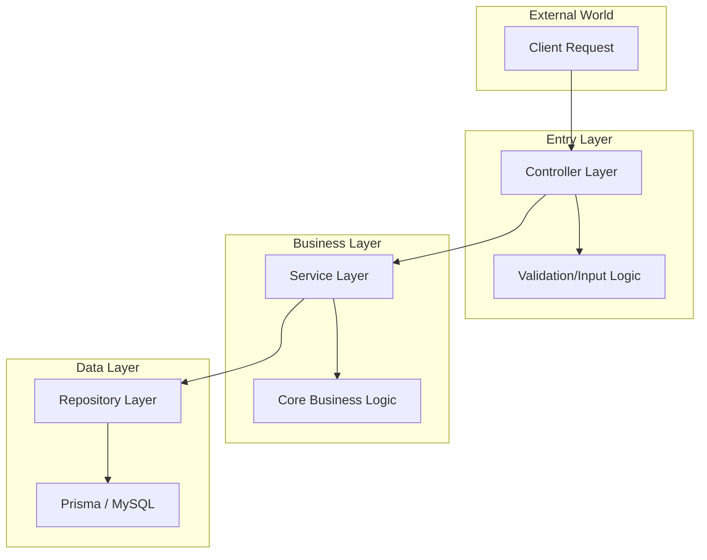

# 🏗️ SYSTEM ARCHITECTURE: GEOMARKET ENGINE
### Clean Architecture & Modular Monolith Design

## 1. Architectural Overview
The GeoMarket platform is built on a **Clean Architecture** paradigm, ensuring a strict separation of concerns through a layered modular monolith. This design prioritizes maintainability, testability, and future horizontal scalability.

*   **Runtime**: Node.js + Express.js
*   **Data Layer**: MySQL with Prisma ORM (Type-safe query engine)
*   **Frontend**: React + TailwindCSS (Modular UI System)

---

## 2. Layered Architecture (Clean Design)
The system is divided into four primary logical layers to isolate business rules from implementation details.



| Layer | Responsibility | Key Component |
| :--- | :--- | :--- |
| **Controller** | Request orchestration, response handling, and input validation. | `controller.js` |
| **Service** | Centralized business logic and system rule enforcement. | `service.js` |
| **Repository** | Abstracted database operations and Prisma entity mapping. | `repository.js` |
| **Persistence** | Relational data storage and schema enforcement. | `schema.prisma` |

---

## 3. Directory Structure (Modular Layout)
Each core domain is encapsulated within its own module to prevent tight coupling.

```text
backend/
├── src/
│   ├── modules/            # Domain-Specific Modules (Encapsulated)
│   │   ├── auth/           # JWT & RBAC Management
│   │   ├── leads/          # Marketplace Intake & Distribution
│   │   ├── professionals/  # Onboarding & Fleet Metadata
│   │   ├── jobs/           # Assignment & Scheduling
│   │   ├── categories/     # Service Taxonomy
│   │   ├── locations/      # Geographic Hubs
│   │   ├── subscriptions/  # Financial Tiers & Billing
│   │   └── dashboard/      # Analytics Aggregation
│   ├── common/             # Global Middlewares, Utils, & Constants
│   ├── config/             # DB & Environment Orchestration
│   ├── app.js              # Express Instance
│   └── server.js           # Process Entry Point
├── prisma/                 # Database Schema & Migrations
└── package.json
```

---

## 4. Database Design (Relational Schema)
The platform utilizes a structured relational schema to maintain high data integrity.

### 👥 User & Identity
*   **User**: Primary identity model (Admin/Professional) with RBAC roles.
*   **Professional**: Extended profile linked to User (Service, Location, Experience, Rating).

### 📋 Operations & Fulfillment
*   **Lead**: Primary marketplace unit (Customer Name, Service, Status: `NEW`, `ASSIGNED`, `COMPLETED`).
*   **Job**: Scheduling unit linking a Lead to a Professional (Date, Time, Fulfillment Status).

### 🌍 Infrastructure & Financials
*   **Category**: Service taxonomy definitions (Plumbing, HVAC, etc.).
*   **Location**: Geographic registry for density analytics (City, State, Country).
*   **Subscription**: Professional billing tiers (Starter/Pro/Premium) with renewal cycles.
*   **Review/Message**: Social and communication metadata for trust-building.

---

## 5. Security & Authentication
*   **Authentication Engine**: Role-Based Entry (Admin/Professional) with mandatory email/password (min 6 chars) validation before JWT issuance.
*   **Strategy**: JWT-based stateless authentication with secure credential masking.
*   **Access Control**: Role-Based Access Control (RBAC) enforced at the middleware layer.
*   **Roles**:
    1.  `ADMIN`: Full operational and system configuration access.
    2.  `PROFESSIONAL`: Restricted access to individual leads, jobs, and profile analytics.

---

## 6. Scalability Roadmap
1.  **Phase 1 (MVP)**: Single-instance Modular Monolith.
2.  **Phase 2 (Growth)**: Implementation of **Redis** for analytical caching and **BullMQ** for async notification queues.
3.  **Phase 3 (Enterprise)**: Decomposition into **Microservices** (Auth-svc, Notify-svc, Lead-svc) for independent scaling.

---
*Verified Architectural Standard: March 2026*
