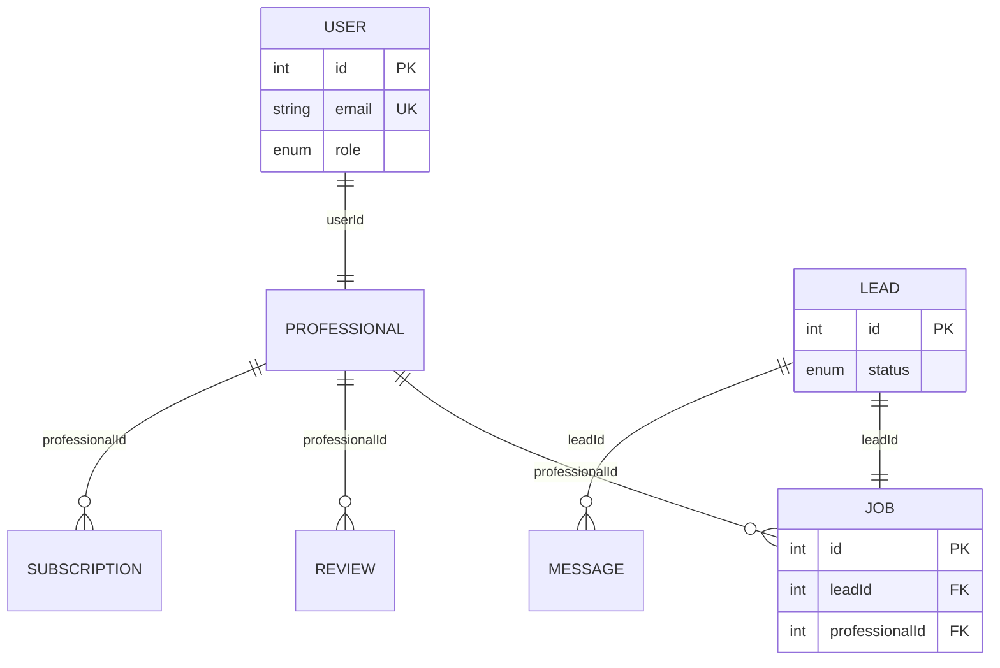

# 🗄️ DATABASE DESIGN: GEOMARKET ENGINE
### Relational Schema, Prisma Modeling, & Performance Optimization

## 1. Overview
The GeoMarket platform utilizes a robust relational database structure managed via **MySQL** and **Prisma ORM**. This ensures high data integrity, type-safe queries, and efficient schema migrations.

*   **Database**: MySQL 8.0+
*   **ORM**: Prisma Client v5.0+
*   **Arch**: Normalized Relational Design

---

## 2. Entity-Relationship (ER) Overview
The platform centers around the **User** identity, extending into specialized **Professional** profiles that interact with **Leads** and **Jobs**.



---

## 3. Core Table Definitions

### 👤 Identity & Access (Users)
*   **User**: Primary auth table. Links to either `ADMIN` or `PROFESSIONAL` roles.
*   **Professional**: Extended metadata for service providers (Service, Location, Rating, Availability).

### 📋 Operations (Leads & Jobs)
*   **Lead**: Marketplace intake unit. Status: `NEW`, `ASSIGNED`, `COMPLETED`, `REJECTED`.
*   **Job**: Scheduling and fulfillment unit bridging Leads to Professionals. Status: `PENDING`, `IN_PROGRESS`, `COMPLETED`.

### 🌍 Infrastructure & Engagement
*   **Category**: Service taxonomies (Unique Name).
*   **Location**: Geographic registry for city/state/country hubs.
*   **Subscription**: Financial tiers (Starter/Pro/Premium) with professional IDs.
*   **Review/Message**: Peer-to-peer feedback and real-time communication logs.

---

## 4. Performance & Indexing Strategy
To ensure sub-second query performance at scale, the following columns are indexed:

| Table | Column | Index Type | Reason |
| :--- | :--- | :--- | :--- |
| **User** | `email` | UNIQUE | Fast lookup during Login/Auth. |
| **Lead** | `status` | INDEX | Optimization for Dashboard filters. |
| **Lead** | `service` | INDEX | Global category-based searches. |
| **Job** | `professionalId`| FK INDEX | Retrieval of active professional schedules. |
| **Message** | `leadId` | FK INDEX | Fast loading of chat threads. |

---

## 5. Production-Ready Prisma Schema
The following schema represents the definitive backend source of truth for the GeoMarket database.

```prisma
// Prisma Schema: LeadMarket Platform
generator client {
  provider = "prisma-client-js"
}

datasource db {
  provider = "mysql"
  url      = env("DATABASE_URL")
}

model User {
  id        Int      @id @default(autoincrement())
  name      String
  email     String   @unique
  password  String
  role      Role
  status    Status   @default(ACTIVE)
  createdAt DateTime @default(now())

  professional Professional?
}

model Professional {
  id           Int      @id @default(autoincrement())
  userId       Int      @unique
  service      String
  location     String
  experience   String?
  rating       Float    @default(0)
  availability Availability @default(AVAILABLE)
  liveTracking Boolean  @default(false)

  user          User           @relation(fields: [userId], references: [id])
  jobs          Job[]
  reviews       Review[]
  subscriptions Subscription[]
}

model Lead {
  id           Int      @id @default(autoincrement())
  customerName String
  service      String
  location     String
  phone        String
  email        String?
  description  String?
  status       LeadStatus @default(NEW)
  createdAt    DateTime @default(now())

  job      Job?
  messages Message[]
}

model Job {
  id             Int      @id @default(autoincrement())
  leadId         Int      @unique
  professionalId Int
  date           DateTime
  status         JobStatus @default(PENDING)

  lead          Lead         @relation(fields: [leadId], references: [id])
  professional  Professional @relation(fields: [professionalId], references: [id])
}

model Category {
  id          Int    @id @default(autoincrement())
  name        String @unique
  description String?
  status      Status @default(ACTIVE)
}

model Location {
  id      Int    @id @default(autoincrement())
  city    String
  state   String
  country String
  status  Status @default(ACTIVE)
}

model Subscription {
  id             Int      @id @default(autoincrement())
  professionalId Int
  plan           String
  amount         Float
  status         SubscriptionStatus @default(ACTIVE)
  startDate      DateTime @default(now())

  professional Professional @relation(fields: [professionalId], references: [id])
}

model Review {
  id             Int      @id @default(autoincrement())
  professionalId Int
  rating         Int
  review         String?
  createdAt      DateTime @default(now())

  professional Professional @relation(fields: [professionalId], references: [id])
}

model Message {
  id        Int      @id @default(autoincrement())
  leadId    Int
  sender    Sender
  message   String
  createdAt DateTime @default(now())

  lead Lead @relation(fields: [leadId], references: [id])
}

// Enumerations
enum Role         { ADMIN; PROFESSIONAL }
enum Status       { ACTIVE; SUSPENDED }
enum LeadStatus   { NEW; ASSIGNED; COMPLETED; REJECTED }
enum JobStatus    { PENDING; IN_PROGRESS; COMPLETED }
enum Availability { AVAILABLE; BUSY }
enum Sender       { CUSTOMER; PROFESSIONAL }
enum SubscriptionStatus { ACTIVE; CANCELLED }
```

---
*Verified Database Standard: March 2026*
