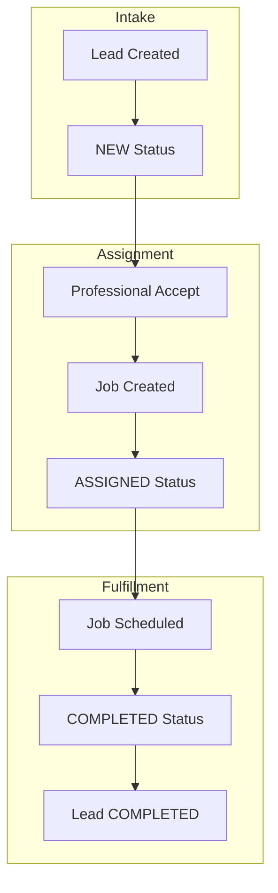

# 🔄 SYSTEM FLOW: GEOMARKET PIPELINE
### Lead → Assignment → Job → Completion Ecosystem

## 1. Overview
The GeoMarket platform operates on a high-velocity, bidirectional pipeline that synchronizes administrative intake with professional service fulfillment.

---

## 2. Lead Lifecycle Management (Core Flow)
The primary unit of platform value is the **Lead**, which transitions through a strict state-machine hierarchy.

### 🧾 Lead Creation & Intake
1.  **Admin Initiation**: Lead is created via the Admin Dashboard.
2.  **Persistence**: Stored in DB with status: `NEW`.
3.  **Visibility**: Broadcasted to all professionals matching the service category.

### 🔁 Lead Status Transitions
*   **NEW**: Initial state, visible but unassigned.
*   **ASSIGNED**: Locked to a specific professional; job record created.
*   **COMPLETED**: Service rendered; job finalized.
*   **REJECTED**: (Optional) Service declined or lead invalidated.

---

## 3. Job & Fulfillment Logic
A **Job** is the operational unit of work that bridges a Lead to a Professional.

1.  **Trigger**: Automatic creation upon lead acceptance (or manual Admin assignment).
2.  **Scheduling**: Execution date and time are assigned.
3.  **Status Workflow**: `PENDING` → `IN_PROGRESS` → `COMPLETED`.

---

## 4. Role-Based Operation Flows

### 🛡️ Admin Flow (Operational Control)
*   **Intake**: Create, view, and assign leads.
*   **Fleet Mgmt**: Add, edit, and suspend professionals.
*   **Marketplace Config**: Manage service categories and geographic locations.
*   **Revenue**: Create subscription plans and monitor active professional billing.

### 👷 Professional Flow (Service Hub)
*   **Engagement**: Review available leads and perform Accept/Reject actions.
*   **Fulfillment**: Upon acceptance, the lead becomes an assigned job.
*   **Communication**: Direct chat stream with the lead's customer.
*   **Social Proof**: Service completion triggers user review/rating calculation.

---

## 5. Engagement Ecosystem (Chat & Reviews)
*   **💬 Chat Flow**: Bidirectional messaging stream (Customer ↔ Professional) with real-time persistence.
*   **⭐ Review Flow**: Post-completion trigger; customer submits rating; professional profile reputation updates.

---

## 6. Infrastructure & Dynamic Flows
*   **🔐 Auth Flow**: 
    1.  **Identity Choice**: Admin/Professional toggle selection.
    2.  **Credential Intake**: Email + Password (min 6 chars).
    3.  **Submission**: Dynamic CTA (e.g., `Login as Admin`).
    4.  **JWT Token Generation**: Server validation of role-specific credentials.
    5.  **RBAC Verification**: Middleware gatekeeping for all downstream APIs.
*   **📦 Subscription Flow**: Plan selection (Starter/Pro/Premium) → Subscription record stored → Leads limit enforced.
*   **🗺️ Live Tracking**: Professional GPS toggle → Telemetry data transmission → Admin real-time view.

---

## 🚨 7. Edge Case Management
*   **Unaccepted Lead**: Retains `NEW` status and remains visible to the fleet.
*   **Professional Suspension**: Immediate restriction of lead visibility and acceptance rights.
*   **Expired Subscription**: Restriction of new lead acquisitions until tier renewal.

---
*Verified Operational Standard: March 2026*
