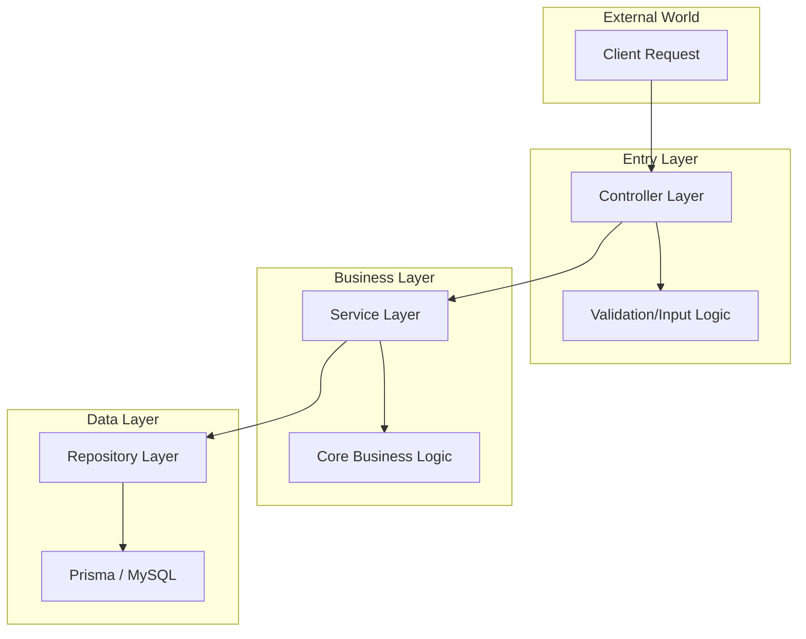
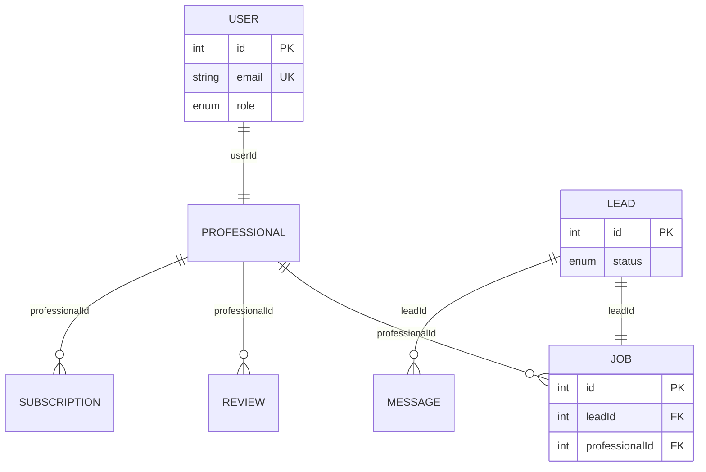
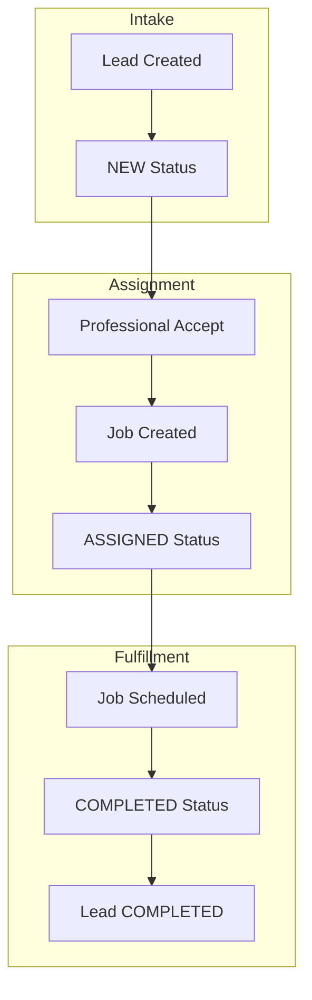

# 🌍 GEOMARKET ENGINE: COMPREHENSIVE PROJECT DOCUMENTATION
> **Unified Source of Truth for Geo-Intelligence Lead Management**

## 📑 TABLE OF CONTENTS
1. [Product Requirement Document (PRD)](#1-product-requirement-document-prd)
2. [Project Development Status (CONTEXT)](#2-project-development-status-context)
3. [System Architecture (ARCHITECTURE)](#3-system-architecture-architecture)
4. [Database Design (DATABASE)](#4-database-design-database)
5. [API Specification (API-SPEC)](#5-api-specification-api-spec)
6. [System Flow (FLOW)](#6-system-flow-flow)
7. [System Rules & Validations (RULES)](#7-system-rules--validations-rules)

---

## 1. 📘 PRODUCT REQUIREMENT DOCUMENT (PRD)
### 🎯 Product Overview: Geo-Intelligence Lead Management System

**Project Vision**: An ultra-high-velocity platform designed for platform owners (Admins) and service providers (Professionals) to manage service leads, assign jobs with geo-spatial intelligence, and optimize marketplace density.

### 👥 USER ROLES & PERMISSIONS

#### 🛡️ Admin (Control Center)
*   **Operations**: Manage leads, assign jobs, and monitor platform performance.
*   **Resources**: Create/Manage Service Categories and Marketplace Locations.
*   **Personnel**: Full oversight of Registered Professionals and Status Control.
*   **Financials**: Subscription tier management and professional billing.

#### 👷 Professional (Service Provider)
*   **Engagement**: View service leads, accept/reject opportunities.
*   **Communication**: Direct chat system with customers.
*   **Growth**: Track personal conversion rates, reviews, and performance.
*   **Account**: Manage business profile, availability, and geo-tracking.

### 🔑 LOGIN INTERFACE (AUTHENTICATION)
The entry point of the platform features a high-end, role-aware authentication layers.

#### 🔹 1. Role Selection (The Core Toggle)
*   **Interaction**: A premium toggle/switch to select between `ADMIN` and `PROFESSIONAL`.
*   **Logic**: Updates the system context and dynamic UI elements instantly.

#### 🔹 2. Credential Geometry
*   **Email Field**: Label: `Email Address` | Placeholder: `pro@demo.com`.
*   **Password Field**: Label: `Password` | Placeholder: `••••••••` | Security: Masked by default.
*   **Forgot Password**: Clear redirect path to the `/forgot-password` workflow.

#### 🔹 3. Intelligent Submission
*   **Dynamic CTA**: The submit button text updates based on selection:
    *   `Login as Admin`
    *   `Login as Professional`
*   **Validation**: Required fields, e-mail formatting, and minimum 6-character password depth.

### 📊 ADMIN CORE MODULES

#### 🚀 1. Marketplace Dashboard
| Component | Metric / Feature |
| :--- | :--- |
| **Stats Grid** | Total Leads, Total Professionals, Leads Today, Conversion Rate. |
| **Weekly Activity** | Mon-Sun numerical intensity tracking for lead submission. |
| **Growth Analytics** | New Professionals (%), Completion Rate (%), Platform Usage (%), Retention (%). |

#### 📋 2. Leads Management
*   **Add Lead (Form)**: Name, Service (Category), Location (City/State), Date (Preferred), Description.
*   **Table View**: Lead ID, Name, Service, Location, Status (`New`, `Assigned`, `Completed`), Date.
*   **Filters**: Real-time toggles for status-based lead density.
*   **Detailed Intake**: Full customer profile (Phone, Email, Service Description).

#### 🛠️ 3. Job & Fleet Operations
*   **Job Creation**: Dedicated form for Service assignment including Assigned Professional, Schedule Time, and Service Location.
*   **Professional Management**: Full profile creation (Business Name, Category, Experience, Phone/Email, Location Stack).
*   **Personnel Status**: Simple `Active` ↔ `Suspended` toggle control.

#### 🌍 4. System Infrastructure
*   **Service Categories**: Name, Description, Backend Data (Status, Total Providers Count).
*   **Location Hubs**: City, State, Country management with auto-calculated Lead/Pro density.
*   **Security Settings**: Admin User, Primary Contact e-mail, and Security Key (Password) management.

### 👨‍🔧 PROFESSIONAL CORE MODULES

#### 📈 1. Performance Dashboard
*   **Operational Glance**: New Leads Today, Total Leads, Accepted Leads, Conversion Rate (%).
*   **State Control**: Online/Offline status switch with Live Tracking toggle.

#### 📋 2. Lead Opportunity Hub
*   **Interaction**: Card-based view of available leads with absolute `Accept` or `Reject` actions.
*   **Details**: View customer location, category, and preferred timeline before acceptance.

#### 💬 3. Engagement & Trust
*   **Chat System**: Integrated messaging platform for direct customer interaction.
*   **Reviews & Ratings**: Comprehensive list of customer feedback with aggregated star ratings.

#### 💳 4. Growth & Billing
*   **Subscription Plans**: View current active plan details and available upgrade tiers (Starter/Pro/Premium).
*   **Profile Management**: Business identity settings, hourly rates, and service radius configurations.

### 🎨 DESIGN & TYPOGRAPHY STANDARDS

#### A. Typography Hierarchy
*   **Main Headers**: 1.5rem (24px) / 700 Bold (`text-2xl font-bold`).
*   **Sub-Headers**: 1.125rem (18px) / 700 Bold (`text-lg font-bold`).
*   **Stat Values**: 1.125rem (18px) / 700 Bold (`text-lg font-bold`).
*   **Labels**: 10px / 800 ExtraBold / Wide Tracking (`text-[10px] font-black tracking-widest`).

#### B. Layout Specifications
*   **Offset**: `0px` from Top/Left edges for maximum operational space.
*   **Geometry**: Standardized `rounded-[2rem]` for main modules and `rounded-xl` for utility components.
*   **Theme**: Pure white (`bg-white`) on subtle neutral slate (`bg-gray-50`) background.

---

## 2. 🔄 PROJECT DEVELOPMENT STATUS (CONTEXT)
### Operational Tracking for Antigravity AI Implementation

### 🎯 Current Status
*   **Current Module**: Infrastructure & Documentation
*   **Active Sprint**: Design System & Architectural Standardization

### ✅ Completed Tasks
*   **prd.md**: Product Requirements, User Roles, and Login Interface finalized.
*   **ARCHITECTURE.md**: Clean Architecture (Layered) & Modular Monolith Design documented.
*   **DATABASE.md**: Relational MySQL/Prisma Schema & Indexing strategy established.
*   **API_SPEC.md**: Auth, Leads, Jobs, and Professional fleet endpoints specified.
*   **FLOW.md**: Lead lifecycle, Job fulfillment, and Auth flows mapped.
*   **RULES.md**: RBAC permissions and business validation constraints defined.

### ⏳ Pending Implementation (Next Steps)
1.  **[Controller Layer]**: Implementation of Express controllers for `auth`, `leads`, and `professionals`.
2.  **[Routing Layer]**: Endpoint definitions for all specified modules.
3.  **[Service Layer]**: Business logic integration for lead status transitions.
4.  **[UI Integration]**: Binding administrative forms to backend endpoints.

---

## 3. 🏗️ SYSTEM ARCHITECTURE (ARCHITECTURE)
### Clean Architecture & Modular Monolith Design

### 1. Architectural Overview
The GeoMarket platform is built on a **Clean Architecture** paradigm, ensuring a strict separation of concerns through a layered modular monolith. This design prioritizes maintainability, testability, and future horizontal scalability.

*   **Runtime**: Node.js + Express.js
*   **Data Layer**: MySQL with Prisma ORM (Type-safe query engine)
*   **Frontend**: React + TailwindCSS (Modular UI System)

### 2. Layered Architecture (Clean Design)
The system is divided into four primary logical layers to isolate business rules from implementation details.



| Layer | Responsibility | Key Component |
| :--- | :--- | :--- |
| **Controller** | Request orchestration, response handling, and input validation. | `controller.js` |
| **Service** | Centralized business logic and system rule enforcement. | `service.js` |
| **Repository** | Abstracted database operations and Prisma entity mapping. | `repository.js` |
| **Persistence** | Relational data storage and schema enforcement. | `schema.prisma` |

### 3. Directory Structure (Modular Layout)
Each core domain is encapsulated within its own module to prevent tight coupling.

```text
backend/
├── src/
│   ├── modules/            # Domain-Specific Modules (Encapsulated)
│   │   ├── auth/           # JWT & RBAC Management
│   │   ├── leads/          # Marketplace Intake & Distribution
│   │   ├── professionals/  # Onboarding & Fleet Metadata
│   │   ├── jobs/           # Assignment & Scheduling
│   │   ├── categories/     # Service Taxonomy
│   │   ├── locations/      # Geographic Hubs
│   │   ├── subscriptions/  # Financial Tiers & Billing
│   │   └── dashboard/      # Analytics Aggregation
│   ├── common/             # Global Middlewares, Utils, & Constants
│   ├── config/             # DB & Environment Orchestration
│   ├── app.js              # Express Instance
│   └── server.js           # Process Entry Point
├── prisma/                 # Database Schema & Migrations
└── package.json
```

### 4. Database Design (Relational Schema)
The platform utilizes a structured relational schema to maintain high data integrity.

#### 👥 User & Identity
*   **User**: Primary identity model (Admin/Professional) with RBAC roles.
*   **Professional**: Extended profile linked to User (Service, Location, Experience, Rating).

#### 📋 Operations & Fulfillment
*   **Lead**: Primary marketplace unit (Customer Name, Service, Status: `NEW`, `ASSIGNED`, `COMPLETED`).
*   **Job**: Scheduling unit linking a Lead to a Professional (Date, Time, Fulfillment Status).

#### 🌍 Infrastructure & Financials
*   **Category**: Service taxonomy definitions (Plumbing, HVAC, etc.).
*   **Location**: Geographic registry for density analytics (City, State, Country).
*   **Subscription**: Professional billing tiers (Starter/Pro/Premium) with renewal cycles.
*   **Review/Message**: Social and communication metadata for trust-building.

### 5. Security & Authentication
*   **Authentication Engine**: Role-Based Entry (Admin/Professional) with mandatory email/password (min 6 chars) validation before JWT issuance.
*   **Strategy**: JWT-based stateless authentication with secure credential masking.
*   **Access Control**: Role-Based Access Control (RBAC) enforced at the middleware layer.
*   **Roles**:
    1.  `ADMIN`: Full operational and system configuration access.
    2.  `PROFESSIONAL`: Restricted access to individual leads, jobs, and profile analytics.

---

## 4. 🗄️ DATABASE DESIGN (DATABASE)
### Relational Schema, Prisma Modeling, & Performance Optimization

### 1. Overview
The GeoMarket platform utilizes a robust relational database structure managed via **MySQL** and **Prisma ORM**. This ensures high data integrity, type-safe queries, and efficient schema migrations.

*   **Database**: MySQL 8.0+
*   **ORM**: Prisma Client v5.0+
*   **Arch**: Normalized Relational Design

### 2. Entity-Relationship (ER) Overview
The platform centers around the **User** identity, extending into specialized **Professional** profiles that interact with **Leads** and **Jobs**.



### 3. Core Table Definitions

#### 👤 Identity & Access (Users)
*   **User**: Primary auth table. Links to either `ADMIN` or `PROFESSIONAL` roles.
*   **Professional**: Extended metadata for service providers (Service, Location, Rating, Availability).

#### 📋 Operations (Leads & Jobs)
*   **Lead**: Marketplace intake unit. Status: `NEW`, `ASSIGNED`, `COMPLETED`, `REJECTED`.
*   **Job**: Scheduling and fulfillment unit bridging Leads to Professionals. Status: `PENDING`, `IN_PROGRESS`, `COMPLETED`.

#### 🌍 Infrastructure & Engagement
*   **Category**: Service taxonomies (Unique Name).
*   **Location**: Geographic registry for city/state/country hubs.
*   **Subscription**: Financial tiers (Starter/Pro/Premium) with professional IDs.
*   **Review/Message**: Peer-to-peer feedback and real-time communication logs.

### 4. Performance & Indexing Strategy
To ensure sub-second query performance at scale, the following columns are indexed:

| Table | Column | Index Type | Reason |
| :--- | :--- | :--- | :--- |
| **User** | `email` | UNIQUE | Fast lookup during Login/Auth. |
| **Lead** | `status` | INDEX | Optimization for Dashboard filters. |
| **Lead** | `service` | INDEX | Global category-based searches. |
| **Job** | `professionalId`| FK INDEX | Retrieval of active professional schedules. |
| **Message** | `leadId` | FK INDEX | Fast loading of chat threads. |

### 5. Production-Ready Prisma Schema
```prisma
// Prisma Schema: LeadMarket Platform
generator client {
  provider = "prisma-client-js"
}

datasource db {
  provider = "mysql"
  url      = env("DATABASE_URL")
}

model User {
  id        Int      @id @default(autoincrement())
  name      String
  email     String   @unique
  password  String
  role      Role
  status    Status   @default(ACTIVE)
  createdAt DateTime @default(now())

  professional Professional?
}

model Professional {
  id           Int      @id @default(autoincrement())
  userId       Int      @unique
  service      String
  location     String
  experience   String?
  rating       Float    @default(0)
  availability Availability @default(AVAILABLE)
  liveTracking Boolean  @default(false)

  user          User           @relation(fields: [userId], references: [id])
  jobs          Job[]
  reviews       Review[]
  subscriptions Subscription[]
}

model Lead {
  id           Int      @id @default(autoincrement())
  customerName String
  service      String
  location     String
  phone        String
  email        String?
  description  String?
  status       LeadStatus @default(NEW)
  createdAt    DateTime @default(now())

  job      Job?
  messages Message[]
}

model Job {
  id             Int      @id @default(autoincrement())
  leadId         Int      @unique
  professionalId Int
  date           DateTime
  status         JobStatus @default(PENDING)

  lead          Lead         @relation(fields: [leadId], references: [id])
  professional  Professional @relation(fields: [professionalId], references: [id])
}

model Category {
  id          Int    @id @default(autoincrement())
  name        String @unique
  description String?
  status      Status @default(ACTIVE)
}

model Location {
  id      Int    @id @default(autoincrement())
  city    String
  state   String
  country String
  status  Status @default(ACTIVE)
}

model Subscription {
  id             Int      @id @default(autoincrement())
  professionalId Int
  plan           String
  amount         Float
  status         SubscriptionStatus @default(ACTIVE)
  startDate      DateTime @default(now())

  professional Professional @relation(fields: [professionalId], references: [id])
}

model Review {
  id             Int      @id @default(autoincrement())
  professionalId Int
  rating         Int
  review         String?
  createdAt      DateTime @default(now())

  professional Professional @relation(fields: [professionalId], references: [id])
}

model Message {
  id        Int      @id @default(autoincrement())
  leadId    Int
  sender    Sender
  message   String
  createdAt DateTime @default(now())

  lead Lead @relation(fields: [leadId], references: [id])
}

// Enumerations
enum Role         { ADMIN; PROFESSIONAL }
enum Status       { ACTIVE; SUSPENDED }
enum LeadStatus   { NEW; ASSIGNED; COMPLETED; REJECTED }
enum JobStatus    { PENDING; IN_PROGRESS; COMPLETED }
enum Availability { AVAILABLE; BUSY }
enum Sender       { CUSTOMER; PROFESSIONAL }
enum SubscriptionStatus { ACTIVE; CANCELLED }
```

---

## 5. 🔌 API SPECIFICATION (API-SPEC)
### RESTful API Documentation & Authorization Standards

### 🌐 Base Environment
*   **Base URL**: `http://localhost:5000/api`
*   **Version**: `v1.0.0`
*   **Content-Type**: `application/json`

### 🔐 1. AUTH & IDENTITY MODULE
#### 💳 Register Professional
`POST /auth/register`
*   **Body**: `{ "name": "John Doe", "email": "john@example.com", "password": "...", "role": "PROFESSIONAL" }`

#### 🔑 User Login
`POST /auth/login`
*   **Body**: `{ "role": "ADMIN|PROFESSIONAL", "email": "john@example.com", "password": "..." }`
*   **Response**: `{ "success": true, "token": "JWT_TOKEN", "user": { "id": 1, "role": "ADMIN" } }`

#### 👤 Identity Validation
`GET /auth/me`
*   **Header**: `Authorization: Bearer <TOKEN>`

### 📋 2. LEADS MANAGEMENT
#### ➕ Create Lead (Admin)
`POST /leads`
*   **Body**: `{ "customerName": "Alice", "service": "Plumbing", "location": "Mumbai", "phone": "9999999999", "email": "alice@mail.com", "description": "Pipe leakage", "date": "2026-03-25" }`

#### 🔍 Search & Filter Leads
`GET /leads?status=NEW&search=Alice`

#### ✨ Selection Operations (Professional Only)
*   **Accept Lead**: `POST /leads/:id/accept`
*   **Reject Lead**: `POST /leads/:id/reject`

### 🛠️ 3. JOBS & FULFILLMENT
#### 📐 Schedule New Job
`POST /jobs`
*   **Body**: `{ "leadId": 1, "professionalId": 2, "date": "2026-03-26", "time": "10:00 AM" }`

#### 📄 Job Tracking
*   **List Jobs**: `GET /jobs`
*   **Get Single Job**: `GET /jobs/:id`

#### 🔄 Status Transition
`PUT /jobs/:id/status`
*   **Body**: `{ "status": "COMPLETED" }`

### 👷 4. PROFESSIONAL FLEET
#### 🔍 Fleet Inventory
`GET /professionals?status=Active&service=Plumbing`

#### ✏️ Detailed Profile Control
*   **Update Profile**: `PUT /professionals/:id`
*   **Delete Record**: `DELETE /professionals/:id`

#### 🛡️ Administrative Control
`PUT /professionals/:id/status`
*   **Body**: `{ "status": "Suspended" }`

### 🗂️ 5. INFRASTRUCTURE: CATEGORY & LOCATION
#### 🏷️ Service Taxonomy
*   **Add Category**: `POST /categories`
*   **Update/Delete**: `PUT /categories/:id` | `DELETE /categories/:id`

#### 📍 Marketplace Hubs
*   **Register Hub**: `POST /locations`
*   **Update/Delete**: `PUT /locations/:id` | `DELETE /locations/:id`

### 💳 6. BILLING & SUBSCRIPTIONS
#### 📜 Subscription Catalog
*   **Manage Plans**: `POST /subscriptions/plans` | `GET /subscriptions/plans`

#### 🧾 Professional Enrollment
`POST /subscriptions`
*   **Body**: `{ "professionalId": 1, "plan": "Pro", "amount": 79 }`

### 💬 7. ENGAGEMENT: CHAT & REVIEWS
#### 🧵 Message Streams
*   **Retrieve History**: `GET /chat/:leadId`
*   **Send Message**: `POST /chat` | `Body: { "leadId": 1, "message": "..." }`

#### ⭐ Trust Metrics
*   **View Ratings**: `GET /reviews/:professionalId`
*   **Submit Review**: `POST /reviews`

### 🔐 8. AUTHORIZATION MATRIX
| Operation | Role: ADMIN | Role: PROFESSIONAL |
| :--- | :---: | :---: |
| **Create/Edit Leads & Jobs** | ✅ | ❌ |
| **Manage Professionals** | ✅ | ❌ |
| **Infrastructure (Cat/Loc)** | ✅ | ❌ |
| **Accept/Reject Leads** | ❌ | ✅ |
| **Direct Customer Chat** | ❌ | ✅ |
| **View Assigned Leads** | ✅ | ✅ |

### 📦 9. RESPONSE ENVELOPES
*   **✅ Standard Success**: `{ "success": true, "data": { ... } }`
*   **❌ Standard Error**: `{ "success": false, "message": "Detailed error context" }`

---

## 6. 🔄 SYSTEM FLOW (FLOW)
### Lead → Assignment → Job → Completion Ecosystem

### 1. Overview
The GeoMarket platform operates on a high-velocity, bidirectional pipeline that synchronizes administrative intake with professional service fulfillment.



### 2. Lead Lifecycle Management (Core Flow)
The primary unit of platform value is the **Lead**, which transitions through a strict state-machine hierarchy.

#### 🧾 Lead Creation & Intake
1.  **Admin Initiation**: Lead is created via the Admin Dashboard.
2.  **Persistence**: Stored in DB with status: `NEW`.
3.  **Visibility**: Broadcasted to all professionals matching the service category.

#### 🔁 Lead Status Transitions
*   **NEW**: Initial state, visible but unassigned.
*   **ASSIGNED**: Locked to a specific professional; job record created.
*   **COMPLETED**: Service rendered; job finalized.
*   **REJECTED**: (Optional) Service declined or lead invalidated.

### 3. Job & Fulfillment Logic
1.  **Trigger**: Automatic creation upon lead acceptance (or manual Admin assignment).
2.  **Scheduling**: Execution date and time are assigned.
3.  **Status Workflow**: `PENDING` → `IN_PROGRESS` → `COMPLETED`.

### 4. Role-Based Operation Flows
#### 🛡️ Admin Flow (Operational Control)
*   **Intake**: Create, view, and assign leads.
*   **Fleet Mgmt**: Add, edit, and suspend professionals.
*   **Marketplace Config**: Manage service categories and geographic locations.
*   **Revenue**: Create subscription plans and monitor active professional billing.

#### 👷 Professional Flow (Service Hub)
*   **Engagement**: Review available leads and perform Accept/Reject actions.
*   **Fulfillment**: Upon acceptance, the lead becomes an assigned job.
*   **Communication**: Direct chat stream with the lead's customer.
*   **Social Proof**: Service completion triggers user review/rating calculation.

### 5. Engagement Ecosystem (Chat & Reviews)
*   **💬 Chat Flow**: Bidirectional messaging stream (Customer ↔ Professional) with real-time persistence.
*   **⭐ Review Flow**: Post-completion trigger; customer submits rating; professional profile reputation updates.

### 6. Infrastructure & Dynamic Flows
*   **🔐 Auth Flow**: Identity Choice → Credential Intake → Submission → JWT Generation → RBAC Verification.
*   **📦 Subscription Flow**: Plan selection → Subscription record stored → Leads limit enforced.
*   **🗺️ Live Tracking**: Professional GPS toggle → Telemetry data transmission → Admin real-time view.

---

## 7. 📏 SYSTEM RULES & VALIDATIONS (RULES)
### Business Intelligence, Data Constraints, & Security Standards

### 1. Core Philosophy: The Golden Rule
> **"Never trust the frontend — Always validate and sanitize on the backend."**
All business logic and data integrity must be strictly enforced at the Service and Repository layers regardless of UI-level guards.

### 2. Role-Based Access Control (RBAC)
*   **🛡️ Admin Authority**: Full CRUD on all modules; complete operational oversight.
*   **👨‍🔧 Professional Constraints**: restricted to service fulfillment and profile management; no infrastructure access.

### 3. Entity Lifecycle Rules
*   **📋 Lead Integrity**: Mandatory Name, Service, Location, Phone. State-locked after completion.
*   **🛠️ Job Scheduling**: Requires valid Lead and Professional.
*   **👮 Professional Compliance**: One Email = One Account. Suspension blocks lead acquisition.

### 4. Infrastructure & Billing Constraints
*   **🏷️ Categories & 📍 Locations**: Uniqueness required. Soft-deletion protection if records are linked.
*   **💳 Subscription Tiers**: Plan prices > 0. Mandatory leads cap enforcement.

### 5. Engagement & Security Standards
*   **💬 Chat & ⭐ Reviews**: Restricted to associated Lead participants. Reviews post-completion only (1-5 scale).
*   **🔐 System Security**: Email/Password required (min 6 chars). JWT Bearer token mandatory for protected APIs.
*   **Telemetry**: GPS update intervals capped at 15 seconds.

### 🚨 6. Error Handling & Validation
| Status Code | Context | Requirement |
| :--- | :--- | :--- |
| **400 (Bad Request)** | Invalid input / Missing fields | Detailed validation message returned. |
| **401 (Unauthorized)**| Missing / Expired JWT | Token refresh or Login required. |
| **403 (Forbidden)**   | Role mismatch / Permission denied | Access restricted. |
| **404 (Not Found)**   | Missing entity | Standardized "Not Found" response. |
| **500 (Server Error)**| Backend exception | Error logged; generic message sent to client. |

---
*Document Version: 1.0.0 | Last Updated: March 2026*
